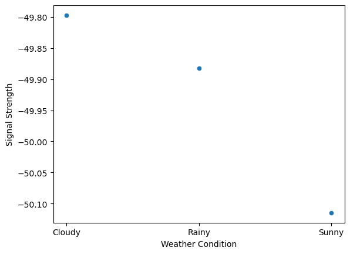

# RF Data Analysis

An analysis of a selection of RF signal data with a particular focus on signal quality and environmental factors.

# DATA INVALID FOR DESIRED USE CASE - DO NOT USE

#### Table of Contents

- [RF Data Analysis](#rf-data-analysis) - [Table of Contents](#table-of-contents)
  - [Introduction](#introduction)
  - [Questions](#questions)
  - [The Data](#the-data)
    - [Columns](#columns)
      - [Categorical Fields:](#categorical-fields)
      - [Quantitative Fields:](#quantitative-fields)
  - [Potential Analysis Avenues](#potential-analysis-avenues)
    - [Signal Classification:](#signal-classification)
    - [Interference Detection:](#interference-detection)
    - [Device Performance Optimization:](#device-performance-optimization)
    - [Weather Condition Analysis:](#weather-condition-analysis)
    - [Geolocation:](#geolocation)
  - [Data Cleaning/Transformation](#data-cleaningtransformation)
  - [Findings](#findings)
  - [Conclusion](#conclusion)
  - [Future Analysis](#future-analysis)

## Introduction

This project focuses on analyzing RF signal data collected via SDR hardware interfaced to DragonOS Focal over a period of one month (May 5, 2023, to June 11, 2023). The goal is to understand how various factors impact signal quality and to explore potential improvements in RF signal processing and device performance.

## Questions

1. How does the environment impact the signal quality? (i.e. weather, interference, location)
2. How does device performance impact the signal quality?
3. Are some modulations better for retaining signal quality in this environment and on this system?

## The Data

The dataset contains RF signal observations with various features describing the signal and its environment.

Link: [RF Signal Data](https://www.kaggle.com/datasets/suraj520/rf-signal-data)

### Columns

#### Categorical Fields:

- Modulation: The modulation type used for the RF signal. Options: AM, FM, QAM, BPSK, QPSK, 8PSK.
- Location: The location where the signal was observed (e.g., city and state/province).
- Device Type: The type of RF device used. Options: HackRF, Halow-U, SteamDeck.
- Antenna Type: The type of antenna used. Options: Omnidirectional, Directional, Dipole, Yagi.
- Weather Condition: The weather condition. Options: Sunny, Rainy, Cloudy.
- Interference Type: The type of interference. Options: None, Co-channel, Adjacent-channel, Intermodulation.
- Power Source: Whether the device is plugged into a power source. Options: Yes, No.
- Device Status: The current status of the device. Options: Streaming I/Q data, Transmitting beacon signal, Running game.

#### Quantitative Fields:

- Timestamp: The date and time of the signal observation.
- Frequency: The frequency of the RF signal in Hertz (Hz).
- Signal Strength: The strength of the RF signal in decibels relative to one milliwatt (dBm).
- Bandwidth: The bandwidth of the RF signal in Hertz (Hz).
- Temperature: The temperature at the location in degrees Celsius.
- Humidity: The relative humidity at the location as a percentage.
- Wind Speed: The speed of the wind at the location in kilometers per hour (km/hr).
- Precipitation: The amount of precipitation at the location in millimeters (mm).
- Battery Level: The remaining battery level of the device as a percentage.
- CPU Usage: The percentage of the CPU usage of the device.
- Memory Usage: The percentage of the memory usage of the device.
- WiFi Strength: The strength of the WiFi signal in dBm.
- Disk Usage: The percentage of the disk usage of the device.
- System Load: The system load of the device.
- Latitude: The latitude of the location.
- Longitude: The longitude of the location.
- Altitude: The altitude of the location in meters.
- Air Pressure: The air pressure at the location in hectopascals (hPa).
- I/Q Data: The in-phase and quadrature components of the signal as a complex valued array.

## Potential Analysis Avenues

#### Signal Classification:

The dataset can be used to classify RF signals based on their modulation type, frequency, bandwidth, and other features. This can help in identifying specific types of signals, such as voice or data transmissions, and can aid in tasks such as signal detection, interception, and decoding.

#### Interference Detection:

The dataset contains information about the type and level of interference present in the environment. This can be used to develop models for detecting and mitigating interference, which can improve the overall quality of the RF signal.

#### Device Performance Optimization:

The dataset includes information about the type of RF device used to generate the signal, as well as its CPU usage, memory usage, and battery level. This can be used to develop models for optimizing the performance of RF devices, such as reducing power consumption or improving signal quality.

#### Weather Condition Analysis:

The dataset provides information about the weather conditions at the time of signal observation, including temperature, humidity, wind speed, precipitation, and weather condition. This can be used to analyze the impact of weather conditions on RF signal propagation and to develop predictive models for signal behavior under different weather conditions.

#### Geolocation:

The dataset includes latitude and longitude information for each signal observation. This can be used to develop models for geolocation of RF signals, which can aid in tasks such as tracking and surveillance.

## Data Cleaning/Transformation

Dropped null columns and grouped by signal identifiers.

## Findings

The data shows that the signal quality is best when it is cloudy, second best when it is rainy, and worst when it is sunny:

These findings are contrary to signal theory and the laws of physics.

The data should have revealed a trend more in line with this figure:

Naresh Kumar and A. Teixeira; Dec 2015

## Conclusion

The selected data is not a viable option for answering the questions I have posed.

## Future Analysis

No future analysis should be conducted on this dataset specifically.
